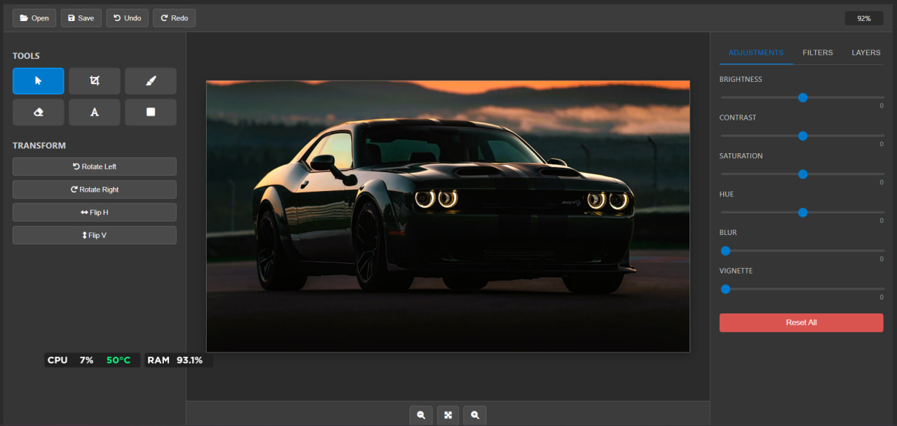

# Advanced Photo Editor

A powerful, free, and open-source photo editing application built with modern web technologies. This project aims to provide a robust, user-friendly alternative to professional photo editing software, accessible directly in the browser.

## Screenshot



This is the current frontend side of the system, it contains features like cropping erasing and more as later written in the features
## Overview

**Advanced Photo Editor** is a feature-rich, browser-based photo editing tool designed to offer a Photoshop-like experience. It allows users to upload images and apply various filters and transformations with an intuitive interface. Currently, the application is entirely frontend-based, leveraging **HTML, CSS, and JavaScript (with the Canvas API)** to deliver real-time image manipulation.

---

## Features

- **Image Upload**: Upload images directly from your device.  
- **Filters**: Adjust brightness, contrast, saturation, hue, blur, sepia, grayscale, invert, and opacity using sliders for precise control.  
- **Transformations**: Rotate images (left/right) and flip them horizontally or vertically.  
- **Real-Time Preview**: Instantly see the effects of applied filters and transformations.  
- **Download**: Save edited images as PNG files.  
- **Responsive UI**: Sleek, modern design with a gradient background and animated transitions, optimized for desktop and mobile devices.  

---

## Current Status

The application is currently a frontend-only project, built with:

- **HTML5** for structure  
- **CSS3** with animations and Tailwind-inspired styling  
- **JavaScript** with the Canvas API for image processing  
- **Roboto** font for a clean, professional look  

---

## Future Plans

The goal is to make **Advanced Photo Editor** a complete, free, and open-source photo editing application. Planned enhancements include:

- **Backend Integration**: Adding a backend (e.g., Node.js, Python, or similar) to support:  
  - Image storage and management  
  - Advanced image processing (e.g., AI-based enhancements, batch editing)  
  - User accounts and cloud-based project saving  

- **Additional Features**:  
  - Layers and compositing  
  - Advanced tools (e.g., crop, resize, text overlay, brushes)  
  - Undo/redo functionality  
  - Support for more file formats (e.g., JPEG, WEBP)  

- **Performance Optimizations**: Improve processing speed for large images  
- **Community Contributions**: Encourage open-source contributions to expand features and improve accessibility  

---

## Installation

To explore or contribute to the project, clone the repository:

```bash
git clone https://github.com/kirubelm1/Filter-App
